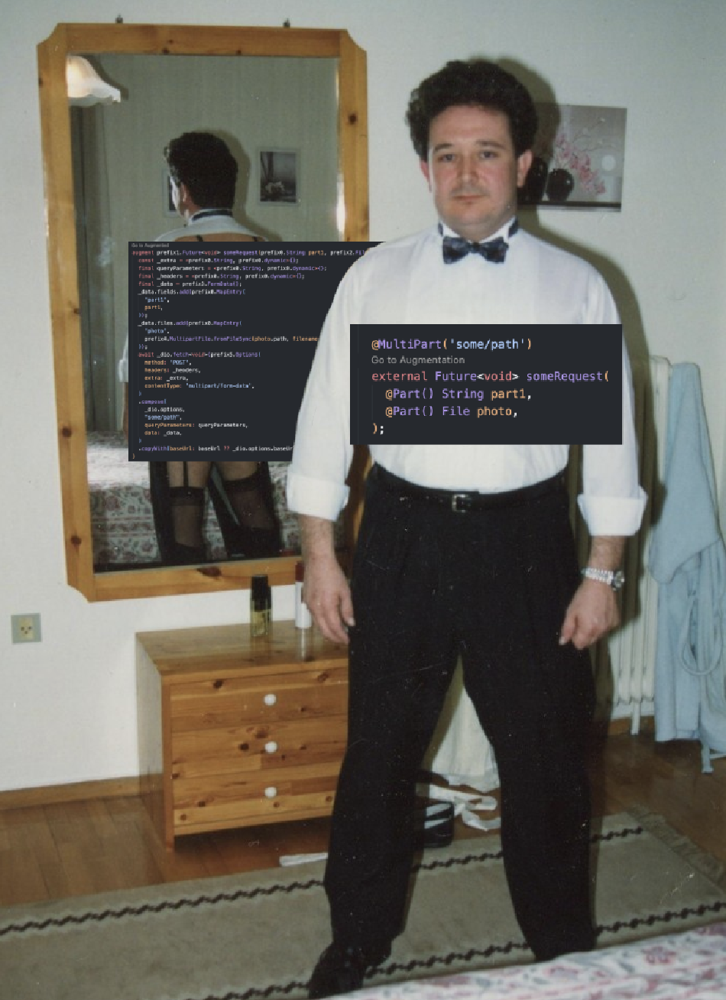

## ~~Retro~~Macrofit for Dart

retrofit.dart is a type conversion dio client generator based on macro feature and inspired by [retrofit.dart](https://pub.dev/packages/retrofit).



### Setup

Since macro is not stable yet, you need to enable it in your `analysis_options.yaml`:


```yaml
include: package:flutter_lints/flutter.yaml

analyzer:
  enable-experiment:
    - macros
```

Also you need use flag `--enable-experiment=macros` when running your app:
```shell
dart run --enable-experiment=macros example/lib/example.dart
```

### Usage

#### Client

Create your client:

```dart
@RestClient()
class ClientExample {

    ClientExample(this._dio, [this.baseUrl]);
}
```

#### Queries

Fill client with your queries. E.g.:
```dart
@RestClient()
class ClientExample {

  ClientExample(this._dio, [this.baseUrl]);

  @MultiPart('some/path')
  external Future<void> someRequest(
    @Part() String part1,
    @Part() File photo,
  );

  @POST('/posts/{userId}')
  external Future<void> updateProfile(
    @Header('Test') String testHeader,
    @Body() String name,
    @Body() String surname,
    String userId,
  );

  @DELETE('/posts/{id}')
  external Future<TestResponse> deletePost(
    @Header('Test') String id,
  );

  @GET('/posts')
  external Future<GenericResponse<List<double>>> getPosts(
    @Query() int page,
    @Query() int limit,
  );
}
```

#### Methods

This library supports `GET`, `POST`, `PUT`, `DELETE` methods. Also you can define your own:
```dart
    @Custom('/posts/{id}', methodName: 'PATCH')
    external Future<PostEntity> patchPost(int id, @Body() String title);
```

#### Parameters

You can use: 
- `@Query` for query parameters (e.g. `?page=1&limit=10`)

```dart
    @GET('/posts')
    external Future<GenericResponse<List<double>>> getPosts(
      @Query() int page,
      @Query() int limit,
    );
```

- `@Body` for request body. E.g:

```dart
    @POST('/posts')
    external Future<void> newPost(
      @Body() String title,
      @Body() String body,
    );
```

- `@Header` for headers. E.g:

```dart
    @GET('/posts')
    external Future<PostEntity> translate(
      @Header('Locale') String locale,
    );
```

- `@Part` for multi-part requests. E.g:

```dart
    @MultiPart('/posts')
    external Future<void> newPost(
      @Part() String title,
      @Part() File photo,
    );
```

- `@Path` for path parameters. Make sure to use the same name in the method and in the path. E.g:

```dart
    @GET('/posts/{id}')
    external Future<PostEntity> getPost(int id);
```

